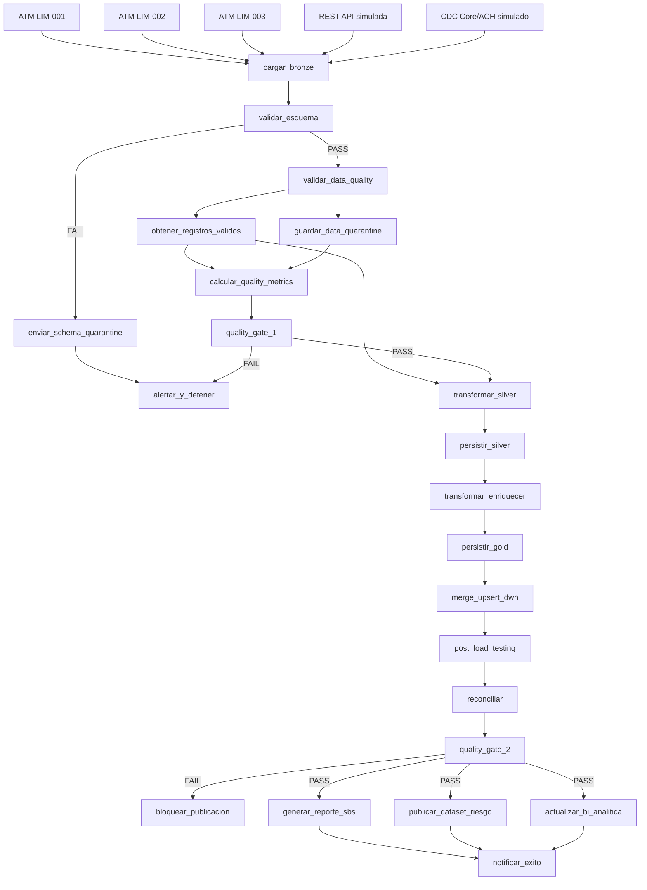

# FinanData DataOps Pipeline

Prueba de concepto universitaria de un pipeline financiero DataOps para
**FinanData Perú**. Integra tres fuentes bancarias simuladas, controles de datos
que detienen lotes defectuosos, arquitectura Medallion y carga idempotente a un
Data Warehouse. Está construida para ejecutarse localmente y para demostrar sus
persistencias cloud posteriormente en Supabase.

## Problema de negocio

El caso parte de duplicados regulatorios, latencias superiores a seis horas,
errores de riesgo y ausencia de trazabilidad. El incidente principal rechazó 15
% de las transacciones, pero el pipeline histórico siguió publicando reportes
incorrectos. Esta PoC convierte la calidad en una autorización explícita: un
Quality Gate fallido impide físicamente que se creen Silver, Gold, carga DWH o
publicaciones posteriores.

## Arquitectura



No existe una task ficticia llamada Data Warehouse o Monitoreo. Supabase
Storage es el Data Lake de demostración, Supabase PostgreSQL es el DWH y la
observabilidad es transversal mediante Prefect y telemetría JSON estructurada.

## Stack y patrón de datos

- Python, Prefect 3, pandas y PyArrow.
- ELT con capas Bronze (RAW), Silver (certificada) y Gold (enriquecida).
- Supabase Storage y PostgreSQL, con backends locales para CI.
- PostgreSQL UPSERT por `transaction_id`, usando `NUMERIC` para dinero.
- pytest, pytest-cov y GitHub Actions.

Bronze agrega `source_system`, `branch_id`, `batch_id`, `flow_run_id`,
`ingestion_timestamp`, `schema_version`, `record_hash` y conserva
`raw_payload`. Silver limpia, normaliza y deduplica. Gold calcula comisión y
Risk Score demo, aplica reglas de negocio y sustituye el IBAN por
`iban_masked`.

## Estructura del repositorio

```text
.github/workflows/ci.yml     CI sin secretos
config/quality_policy.json   Política QG1 configurable
data/source/                 ATM CSV, API JSON y CDC JSON simulados
docs/                        Arquitectura, DAG, Prefect y evidencias
scripts/                     Inicialización DWH y ejecución de demos
sql/dwh_schema.sql           DDL para Supabase PostgreSQL
src/finandata/               Flow, tasks, storage, alertas y telemetría
tests/                       Calidad, transforms, reconciliación y smoke
```

## Instalación local

Se recomienda Python 3.12 o 3.13:

```bash
python -m venv .venv
# Linux/macOS: source .venv/bin/activate
# Windows PowerShell: .venv\Scripts\Activate.ps1
pip install -r requirements.txt
```

Copie `.env.example` como `.env`. `.env` está ignorado por Git y nunca debe
versionarse. Para una ejecución completamente local basta con:

```dotenv
STORAGE_BACKEND=local
DWH_BACKEND=local
LOCAL_DATA_LAKE_ROOT=.local/data-lake
LOCAL_DWH_PATH=.local/finandata.db
```

## Configuración de Supabase Storage

1. Cree el bucket privado `finandata-data-lake` en Supabase.
2. Configure `SUPABASE_URL`, `SUPABASE_SERVICE_ROLE_KEY` y
   `SUPABASE_STORAGE_BUCKET` en `.env`.
3. Seleccione `STORAGE_BACKEND=supabase`.

El código escribirá Parquet bajo `bronze/`, `silver/`, `gold/`,
`schema-quarantine/` y `data-quarantine/`. No crea ni imprime credenciales.

## Configuración del Data Warehouse

Ejecute `sql/dwh_schema.sql` desde el SQL Editor de Supabase o configure
`SUPABASE_DB_URL` y ejecute:

```bash
python scripts/init_dwh.py
```

Para PostgreSQL use `DWH_BACKEND=postgres`; para desarrollo y CI use
`DWH_BACKEND=local`. `fact_transacciones` hace UPSERT idempotente con clave
`transaction_id`. `etl_batch_control` conserva conteos, gates y estado del lote,
incluidos los lotes bloqueados antes de cargar hechos.

## Ejecución con Prefect

Prefect se ejecuta localmente; no se utiliza Prefect Cloud:

```bash
python scripts/run_demo.py success
python scripts/run_demo.py schema_fail
python scripts/run_demo.py incident_15_percent
python scripts/run_demo.py qg2_fail
```

ATM usa mapping y produce tres task runs, uno por sucursal. Junto con API y CDC
convergen en una sola task `cargar_bronze`. Las publicaciones SBS, Riesgo y BI
se ejecutan en paralelo sólo después de QG2.

## Escenarios disponibles

- `success`: 100 registros completan DWH y las tres publicaciones.
- `schema_fail`: un payload móvil omite `currency`; se conserva en
  `schema-quarantine/` y Data Quality no se ejecuta.
- `incident_15_percent`: procesa 100, acepta 85, conserva 15 rechazados y obtiene
  `reject_rate=0.15`; QG1 falla. No se cargan transacciones del lote en
  `fact_transacciones`; únicamente se registra el estado `FAILED_QUALITY` en
  `etl_batch_control` para trazabilidad.
- `qg2_fail`: carga deliberadamente 99 de 100; post-load y reconciliación
  detectan la diferencia, QG2 bloquea toda publicación.

El `max_reject_rate=0.05` es únicamente un **threshold configurable de
demostración**. No representa una regla oficial de SBS ni una política real de
una entidad bancaria.

## Testing y GitHub Actions

```bash
pytest -v
pytest --cov=finandata --cov-report=term-missing
```

Los tests usan Storage y DWH locales, sin Prefect Cloud ni secretos de Supabase.
`.github/workflows/ci.yml` ejecuta instalación y pytest en cada `push` y
`pull_request`; no despliega automáticamente.

## Observabilidad y alertas

`registrar_telemetria` envía eventos estructurados al logger de Prefect (o al
logger estándar fuera de un run) para ingestas, persistencias, gates, DWH,
reconciliación y publicaciones. Las métricas incluyen latencia, conteos,
rechazos, completitud, duplicados, diferencias y estados de publicación.

Las alertas críticas se escriben también en `logs/alerts.jsonl` con severidad,
evento, timestamp, lote, flow run, task, mensaje, métrica y umbral. No hay por
ahora integración con Slack, Teams o correo, y los valores sensibles se
redactan.

## Evidencias

Con backend local, los Parquet quedan en `.local/data-lake`, la base de control
en `.local/finandata.db` y las publicaciones demo en `.local/publications`.
Con Supabase, las capas se inspeccionan desde Storage y las tablas DWH desde el
SQL Editor. Los resultados JSON de `run_demo.py`, los flow/task runs de Prefect
y `etl_batch_control` constituyen las evidencias principales.

## Limitaciones de la PoC

Las fuentes ATM, REST y CDC son simuladas localmente; no hay integración con
sistemas bancarios reales. Comisiones, Risk Score e IBAN usan reglas académicas
de demostración. Las publicaciones crean evidencia local en vez de enviar un
reporte regulatorio real. El reprocesamiento no crea ciclos: un lote corregido
se ejecuta como un flow run nuevo parametrizado.
